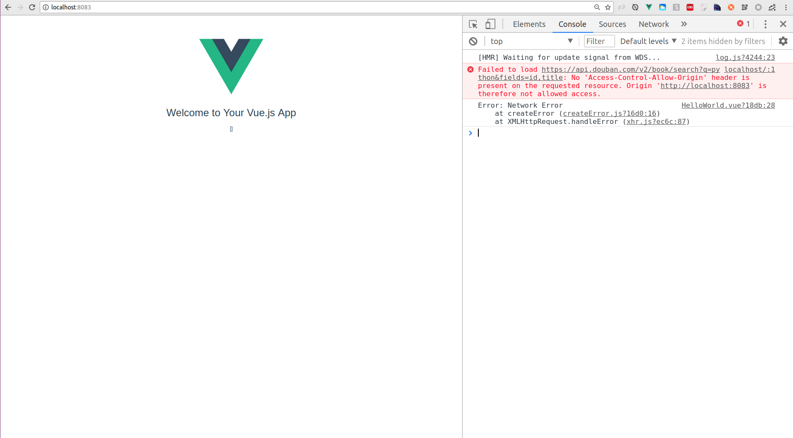
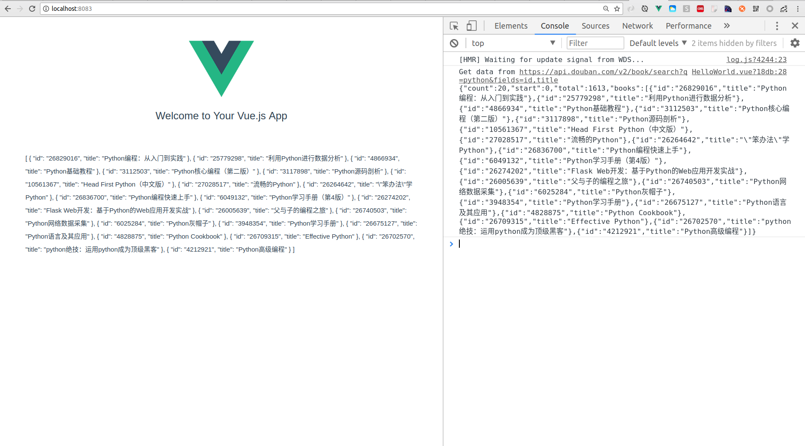

# vue-cli-dev-cross

> vue-cli项目在开发环境下的跨域方法示例。

## Build Setup

``` bash
# install dependencies
npm install

# serve with hot reload at localhost:8080
npm run dev

# build for production with minification
npm run build

# build for production and view the bundle analyzer report
npm run build --report
```

For a detailed explanation on how things work, check out the [guide](http://vuejs-templates.github.io/webpack/) and [docs for vue-loader](http://vuejs.github.io/vue-loader).

## 项目介绍：

这是一个使用vue-cli自带工具解决在开发环境下跨域问题的demo。

（1）解决跨域之前，控制台报跨域的错误，如下图所示：



（2）用该方法（下面会介绍具体操作步骤）解决跨域问题后，可以看到跨域报错不再显示，数据正常获取并在页面显示。




## 操作步骤：

（1）进入根目录的config文件夹，index.js文件，可以看到有一个proxyTable参数对象，这个参数主要是一个地址映射表，接下来对该对象进行配置。

（2）配置代码如下所示：

  ```bash

  proxyTable: {
          '/search': {
              target: 'https://api.douban.com/v2/book',
              changeOrigin: true,
              pathRewrite: {
                '^/search': '/search'
              }
          },
  },
  ```
   这样我们在写url的时候，只用写成 /search?q=python&fields=id,title 就可以代表 https://api.douban.com/v2/book/search?q=python&fields=id,title。  而跨域的实现主要是依靠 changeOrigin 参数，该参数接收一个布尔值，如果设置为true,那么本地会虚拟一个服务端接收你的请求并代你发送该请求，这样就不会有跨域问题了，当然这只适用于 开发环境。
   
   下面是请求跨域接口的函数：
   
   ```bash
   
   getBooksInfo: function () {
      axios.get('/search?q=python&fields=id,title')
      .then(response => {
          console.log('Get data from https://api.douban.com/v2/book/search?q=python&fields=id,title' + '\n' + JSON.stringify(response.data));
          this.books = response.data.books;
        })
        .catch(error => {
          console.log(error)
        })
    }
   
